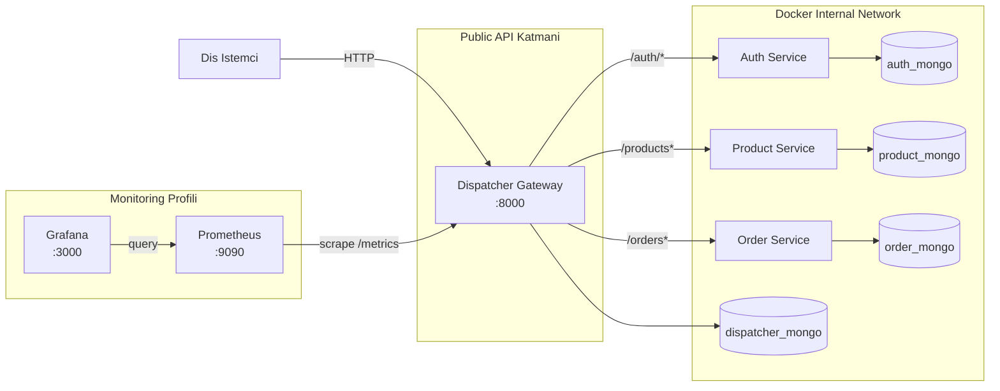
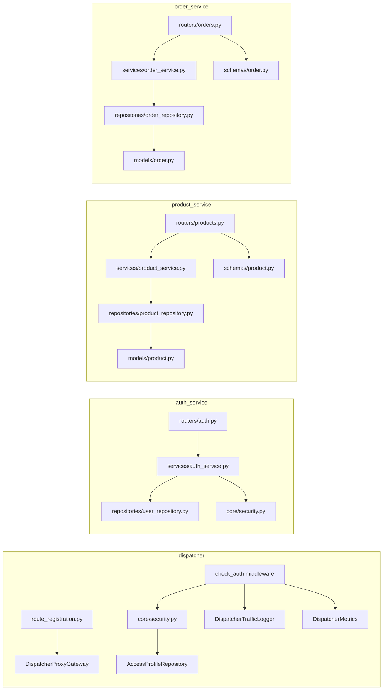
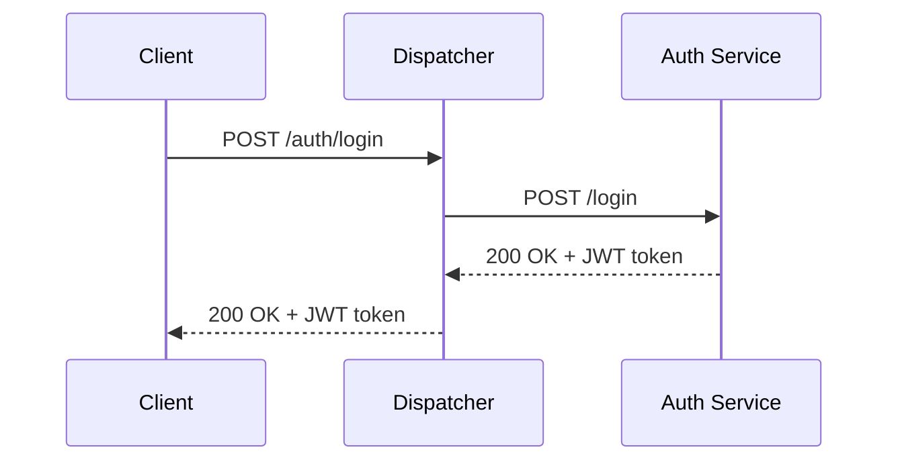

# Product-Order Microservices Projesi

## Proje Adı
Product-Order Microservices

## Ekip Üyeleri
| Ad Soyad | Öğrenci No |
| --- | --- | --- |
| Hüseyin Erekmen | 251307099 |
| Rana Karagöl | 251307101 |


## İçindekiler
1. [Giriş](#giriş)
2. [Problemin Tanımı](#problemin-tanımı)
3. [Projenin Amacı](#projenin-amacı)
4. [Kullanılan Teknolojiler](#kullanılan-teknolojiler)
5. [Sistem Mimarisi](#sistem-mimarisi)
6. [Mikroservislerin Görevleri](#mikroservislerin-görevleri)
7. [Dispatcher/Gateway Mantığı](#dispatchergateway-mantığı)
8. [Kimlik Doğrulama ve Yetkilendirme Yapısı](#kimlik-doğrulama-ve-yetkilendirme-yapısı)
9. [Veri Tabanı İzolasyonu](#veri-tabanı-izolasyonu)
10. [Network Isolation](#network-isolation)
11. [Docker ve Orkestrasyon Yapısı](#docker-ve-orkestrasyon-yapısı)
12. [API Tasarımı](#api-tasarımı)
13. [RESTful Yaklaşım](#restful-yaklaşım)
14. [Richardson Maturity Model Seviye 2](#richardson-maturity-model-seviye-2)
15. [Servis Endpoint Özeti](#servis-endpoint-özeti)
16. [Katmanlı Mimari Açıklaması](#katmanlı-mimari-açıklaması)
17. [Sınıf/Katman Yapısı](#sınıfkatman-yapısı)
18. [İstek Akışları](#istek-akışları)
19. [Sequence Diagramlar](#sequence-diagramlar)
20. [Test Yaklaşımı](#test-yaklaşımı)
21. [Dispatcher Tarafında TDD Uygulaması](#dispatcher-tarafında-tdd-uygulaması)
22. [Commit/TDD Kanıtı İçin Örnek Commit Akışı](#committdd-kanıtı-için-örnek-commit-akışı)
23. [Monitoring ve Görselleştirme](#monitoring-ve-görselleştirme)
24. [Yük Testi (Locust)](#yük-testi-locust)
25. [Başarılar](#başarılar)
26. [Sınırlılıklar](#sınırlılıklar)
27. [Olası Geliştirmeler](#olası-geliştirmeler)
28. [Sonuç](#sonuç)

## Giriş
Bu çalışma, ders isterlerine uygun şekilde tasarlanan bir mikroservis mimarisi raporudur. Sistem, dış istemciler için tek giriş noktası olan bir dispatcher (gateway) üzerinden çalışır ve auth, product, order servislerini bu katman üzerinden erişilebilir hale getirir.

## Problemin Tanımı
Tek uygulama yaklaşımında kimlik doğrulama, ürün yönetimi, sipariş yönetimi ve yönlendirme sorumlulukları aynı kod tabanında birleştiğinde aşağıdaki problemler oluşur:

- Sorumlulukların karışması ve bakım maliyetinin artması
- Güvenlik ve yetkilendirme kontrollerinin dağınık uygulanması
- Performans ve gözlemlenebilirlik ölçümlerinin merkezi toplanamaması
- Servislerin bağımsız ölçeklenememesi
- Tek veritabanı bağımlılığı nedeniyle sınırların zayıflaması

Bu proje, bu problemleri mikroservis sınırları ve merkezi dispatcher yaklaşımı ile çözmeyi hedeflemektedir.

## Projenin Amacı
Projenin ana amaçları aşağıdaki gibidir:

- En az 4 bağımsız birimden oluşan bir mimari kurmak: dispatcher, auth service, product service, order service
- Dispatcher'ı sistemin tek business API giriş noktası olarak konumlandırmak
- Her birimin kendi NoSQL persistence sınırına sahip olmasını sağlamak
- RESTful ve RMM Seviye 2 uyumlu endpoint sözleşmeleri uygulamak
- Dispatcher tarafında TDD kanıtını commit geçmişi ile savunulabilir hale getirmek
- Monitoring (Prometheus + Grafana) ve yük testi (Locust) için raporlanabilir bir zemin hazırlamak

## Kullanılan Teknolojiler
| Kategori | Teknoloji | Bu projedeki kullanım amacı |
| --- | --- | --- |
| Backend çatısı | FastAPI | HTTP API geliştirme, route tanımlama, validation entegrasyonu |
| Programlama dili | Python 3.11 | Servis geliştirme, iş kuralları, testler |
| Doğrulama modeli | Pydantic | Request/response şemaları ve alan doğrulama |
| Veritabanı | MongoDB | Her servis için ayrı NoSQL persistence |
| Mongo istemcisi | Motor (AsyncIOMotorClient) | Asenkron veri erişimi |
| Containerization | Docker | Servisleri izole çalıştırma |
| Orkestrasyon | Docker Compose | Çoklu servis ve profil yönetimi |
| Test | Pytest | Servis ve dispatcher davranış testleri |
| HTTP istemci | httpx | Dispatcher proxy ve test istemcisi |
| Kimlik doğrulama | python-jose, bcrypt | JWT üretimi/doğrulama ve parola hashleme |
| Gözlemlenebilirlik | Prometheus, Grafana | Metrik toplama ve dashboard görselleştirme |

## Sistem Mimarisi
Sistemin genel topolojisi aşağıdaki gibidir:



## Mikroservislerin Görevleri
### 1) Dispatcher
- Dış dünyaya açık ana giriş noktasıdır.
- `/auth`, `/products`, `/orders` trafiğini ilgili iç servislere yönlendirir.
- Ürün ve sipariş kaynaklarına gelen isteklerde merkezi yetkilendirme kontrolü uygular.
- Trafik loglarını ve access profile verisini kendi persistence sınırında tutar.
- `/metrics` endpoint'i ile Prometheus uyumlu metrik üretir.

### 2) Auth Service
- Kullanıcı kayıt (`POST /register`) ve giriş (`POST /login`) işlemlerini yönetir.
- JWT token üretir ve token doğrulama (`GET /verify-token`) sağlar.
- Parola hashleme ve parola doğrulama işlemlerini yürütür.

### 3) Product Service
- Ürün CRUD işlemlerini yönetir:
  - `GET /products`
  - `GET /products/{id}`
  - `POST /products`
  - `PUT /products/{id}`
  - `PATCH /products/{id}`
  - `DELETE /products/{id}`

### 4) Order Service
- Sipariş CRUD ve yaşam döngüsü işlemlerini yönetir:
  - `GET /orders`
  - `GET /orders/{id}`
  - `POST /orders`
  - `PATCH /orders/{id}`
  - `DELETE /orders/{id}`
- Sipariş toplam tutarını (`total_amount`) item listesi üzerinden hesaplar.

## Dispatcher/Gateway Mantığı
Dispatcher, iç servisleri dış dünyadan soyutlayan bir API gateway katmanıdır.

Temel davranışlar:
- Route kayıtları merkezi olarak yapılır (`/auth/{path:path}`, `/products`, `/orders`).
- Auth dışındaki protected kaynaklar için token + access profile kontrolü middleware düzeyinde uygulanır.
- Upstream cevaplarının status code ve body semantiği mümkün olduğunca korunur.
- Upstream bağlantı hatalarında `503 Service Unavailable`, beklenmeyen iç hatalarda `500 Internal Server Error` döndürülür.

Haritalama özeti:
| Dış API (Dispatcher) | İç hedef servis |
| --- | --- |
| `/auth/{path}` | `auth_service/{path}` |
| `/products...` | `product_service/products...` |
| `/orders...` | `order_service/orders...` |

## Kimlik Doğrulama ve Yetkilendirme Yapısı
### Kimlik doğrulama (Authentication)
- Kullanıcı `POST /auth/register` ve `POST /auth/login` akışlarıyla token alır.
- Dispatcher üzerinden gelen `/auth/*` çağrıları auth servisine aktarılır.

### Yetkilendirme (Authorization)
- Dispatcher, `/products` ve `/orders` prefix'leri için koruma uygular.
- Authorization header yoksa veya token geçersizse `401 Unauthorized` döner.
- Token geçerli olsa da ilgili kaynak-yöntem izni yoksa `403 Forbidden` döner.
- Access profile verisi dispatcher'ın kendi `access_profiles` koleksiyonunda tutulur.
- Varsayılan yaklaşımda `default-authenticated` profili okuma odaklıdır (GET izinleri).

## Veri Tabanı İzolasyonu
Servisler arasında paylaşılan tek bir veritabanı yerine, her servis için ayrı MongoDB konteyneri tanımlanmıştır.

| Birim | Mongo Servisi | Varsayılan DB adı | Sınır |
| --- | --- | --- | --- |
| Auth Service | `auth_mongo` | `auth_db` | Kimlik verileri |
| Product Service | `product_mongo` | `product_db` | Ürün verileri |
| Order Service | `order_mongo` | `order_db` | Sipariş verileri |
| Dispatcher | `dispatcher_mongo` | `dispatcher_db` | Trafik logları + access profile |

Bu yapı, persistence boundary ilkesini korur ve servisler arası doğrudan veritabanı bağımlılığını engeller.

## Network Isolation
`docker-compose.yml` içinde tüm servisler `internal_network` ağına bağlıdır.

İzolasyon özeti:
- Auth/Product/Order servisleri host port publish etmez.
- Mongo konteynerleri host port publish etmez.
- Business API için dışa açılan tek kapı dispatcher'dır (`8000:8000`).
- Monitoring profili açıldığında Prometheus (`9090`) ve Grafana (`3000`) gözlem amaçlı ayrıca publish edilir.

Bu nedenle iç servisler doğrudan public endpoint gibi tasarlanmamış, gateway arkasında çalışacak şekilde konumlandırılmıştır.

## Docker ve Orkestrasyon Yapısı
### Runtime başlatma
```bash
docker compose -f src/docker-compose.yml up --build
```

### Monitoring profilini başlatma
```bash
docker compose -f src/docker-compose.yml --profile monitoring up -d prometheus grafana
```

### Test profilini konteyner üzerinde çalıştırma
```bash
docker compose -f src/docker-compose.yml --profile test run --rm auth_tests
docker compose -f src/docker-compose.yml --profile test run --rm dispatcher_tests
docker compose -f src/docker-compose.yml --profile test run --rm product_tests
docker compose -f src/docker-compose.yml --profile test run --rm order_tests
```

### Yerel servis testleri
```bash
cd src/auth_service && pytest tests
cd src/dispatcher && pytest tests
cd src/product_service && pytest tests
cd src/order_service && pytest tests
```

## API Tasarımı
API tasarımı kaynak odaklıdır ve dispatcher dış sözleşmesi üzerinden birleşik bir yüzey sunar.

Tasarım ilkeleri:
- Kaynak bazlı URL yapıları (`/products`, `/orders`, `/auth/...`)
- HTTP methodlarının amaca uygun kullanımı
- Uygun status code üretimi
- Request/response şemalarında alan doğrulama

## RESTful Yaklaşım
Projedeki yöntem dağılımı REST yaklaşımıyla uyumludur:

- `GET`: listeleme/detay okuma
- `POST`: oluşturma veya auth işlem başlangıcı
- `PUT`: ürün kaynağını tam değiştirme
- `PATCH`: kısmi güncelleme
- `DELETE`: kaynak silme

Durum kodları da davranışa göre ayrıştırılmıştır (200, 201, 204, 401, 403, 404, 409, 422, 500, 503).

## Richardson Maturity Model Seviye 2
Bu proje RMM Seviye 2 beklentisini aşağıdaki şekilde karşılar:

- Tek endpoint üstünden action taşıma yerine kaynak odaklı URI tasarımı vardır.
- Farklı işlevler farklı HTTP methodlarına bölünmüştür.
- Method + status code kombinasyonları semantik farkları yansıtır.

## Servis Endpoint Özeti
### Dış sözleşme (dispatcher üzerinden)
| Method | Endpoint | Açıklama |
| --- | --- | --- |
| GET | `/` | Dispatcher sağlık mesajı |
| GET | `/metrics` | Prometheus metrik endpoint'i |
| GET/POST/PUT/PATCH/DELETE | `/auth/{path}` | Auth servisine proxy |
| GET | `/products` | Ürün listesi |
| POST | `/products` | Ürün oluşturma |
| GET | `/products/{id}` | Ürün detayı |
| PUT | `/products/{id}` | Ürün tam güncelleme |
| PATCH | `/products/{id}` | Ürün kısmi güncelleme |
| DELETE | `/products/{id}` | Ürün silme |
| GET | `/orders` | Sipariş listesi |
| POST | `/orders` | Sipariş oluşturma |
| GET | `/orders/{id}` | Sipariş detayı |
| PATCH | `/orders/{id}` | Sipariş kısmi güncelleme |
| DELETE | `/orders/{id}` | Sipariş silme |

### İç servis endpointleri (internal kullanım)
| Servis | Endpointler |
| --- | --- |
| Auth Service | `POST /register`, `POST /login`, `GET /verify-token` |
| Product Service | `GET/POST /products`, `GET/PUT/PATCH/DELETE /products/{id}` |
| Order Service | `GET/POST /orders`, `GET/PATCH/DELETE /orders/{id}` |

### Status code davranış özeti
| Kod | Anlam | Tipik senaryo |
| --- | --- | --- |
| 200 | Başarılı işlem | Listeleme, detay, login |
| 201 | Kaynak oluşturuldu | Ürün/sipariş oluşturma |
| 204 | Gövdesiz başarılı silme | Silme işlemleri |
| 401 | Kimlik doğrulama başarısız | Token yok/geçersiz |
| 403 | Yetki yetersiz | Token geçerli ama izin yok |
| 404 | Kaynak bulunamadı | Geçersiz id veya yanlış route |
| 405 | Method desteklenmiyor | Kaynak için tanımsız method |
| 409 | Çakışma | Aynı kullanıcı adıyla tekrar kayıt |
| 422 | Doğrulama hatası | Şema/field doğrulama hatası |
| 500 | İç hata | Beklenmeyen dispatcher iç hatası |
| 503 | Servis erişilemiyor | Upstream bağlantı problemi |

## Katmanlı Mimari Açıklaması
Projede katmanlar servis bazında ayrılmıştır:

- Router/Controller katmanı: HTTP endpoint tanımı ve hata kodu dönüşleri
- Service katmanı: iş kuralları ve akış yönetimi
- Repository katmanı: veritabanı erişimi
- Schema katmanı: veri doğrulama sözleşmesi
- Model katmanı: domain nesneleri
- Core katmanı: güvenlik, metrik, veritabanı bağlantısı gibi ortak altyapı

Bu ayrım, business logic'in route fonksiyonlarına gömülmesini engeller ve test edilebilirliği artırır.

## Sınıf/Katman Yapısı


## İstek Akışları
### Akış 1: Login
1. İstemci dispatcher üzerinden `/auth/login` çağrısı yapar.
2. Dispatcher isteği auth servisine iletir.
3. Auth servis kimlik bilgilerini doğrular, token üretir.
4. Dispatcher yanıtı istemciye döndürür.

### Akış 2: Yetkili ürün okuma
1. İstemci `Authorization: Bearer <token>` ile `/products` çağrısı yapar.
2. Dispatcher token ve access profile kontrolü yapar.
3. Yetki uygunsa product service'e iletir.
4. Ürün listesi yanıtını istemciye döndürür.

### Akış 3: Yetkisiz yazma isteği
1. İstemci geçerli ama yazma izni olmayan token ile `POST /products` çağırır.
2. Dispatcher erişim profilinde method iznini kontrol eder.
3. İzin yoksa isteği aşağı servise iletmeden `403 Forbidden` döndürür.

### Akış 4: Upstream servis kesintisi
1. İstemci protected endpoint çağırır.
2. Dispatcher yetki kontrolünden sonra ilgili servise iletmek ister.
3. Upstream erişilemiyorsa `503 Service Unavailable` döndürülür.

## Sequence Diagramlar
### Sequence Diagram 1: Login ve token alma


### Sequence Diagram 2: Protected ürün yazma isteğinde yetki kontrolü


## Test Yaklaşımı
Projede test yaklaşımı katmanlı ve davranış odaklıdır:

- Servis testlerinde fake collection kullanılarak veritabanı bağımlılığı azaltılmıştır.
- Dispatcher testlerinde authz, proxy forwarding, hata semantiği, logging ve metrics davranışları doğrulanmıştır.
- Product ve Order servislerinde CRUD akışları ve 404/204 gibi durum kodları test edilmektedir.
- Auth servisinde register/login/verify-token temel akışları test edilmektedir.

Önemli dürüstlük notu:
- Dispatcher tarafında belirgin bir TDD hikayesi commit geçmişinde açıkça izlenebilmektedir.
- Tüm proje için aynı seviyede kesintisiz TDD uygulandığı iddia edilmemektedir.

## Dispatcher Tarafında TDD Uygulaması
Dispatcher geliştirmelerinde commit geçmişinde Red -> Green -> Refactor örüntüsü gözlenmektedir.

Örnek TDD döngüleri:
- Upstream `503` semantiği
  - `7873d5e` test(dispatcher): red upstream failure returns 503
  - `ce856a6` feat(dispatcher): green upstream failure returns 503
  - `173c85a` refactor(dispatcher): polish upstream handling
- Internal `500` semantiği
  - `1741470` test(dispatcher): red internal dispatcher error returns 500
  - `1c64eac` feat(dispatcher): green internal dispatcher error returns 500
  - `e7e0b1b` refactor(dispatcher): polish internal error handling
- Route guard doğrulaması
  - `662d8b3` test(dispatcher): red exact protected route matching
  - `35f93b9` feat(dispatcher): green exact protected route matching
  - `f2c0d50` refactor(dispatcher): polish protected route matching
- Prometheus metrikleri
  - `254317d` test(dispatcher): red prometheus request metrics
  - `91a0442` feat(dispatcher): green prometheus request metrics
  - `3e87201` refactor(dispatcher): polish metrics instrumentation

## Commit/TDD Kanıtı İçin Örnek Commit Akışı
| Akış | Test (Red) | Uygulama (Green) | Refactor |
| --- | --- | --- | --- |
| Upstream hata yönetimi | `7873d5e` | `ce856a6` | `173c85a` |
| Internal hata yönetimi | `1741470` | `1c64eac` | `e7e0b1b` |
| Route guard doğruluğu | `662d8b3` | `35f93b9` | `f2c0d50` |
| Dispatcher metrikleri | `254317d` | `91a0442` | `3e87201` |

## Monitoring ve Görselleştirme
Projede monitoring katmanı Prometheus + Grafana ile yapılandırılmıştır.

### Prometheus'un rolü
- Dispatcher'ın `/metrics` endpoint'ini scrape ederek metrik toplar.
- Request sayacı ve latency histogram verilerini sorgulanabilir hale getirir.

### Grafana dashboard'un rolü
Provision edilen `Dispatcher Overview` dashboard'u aşağıdaki panelleri içerir:
- `Requests (15m)`
- `Status Codes (15m)`
- `Request Latency P95`

### Monitoring kanıt placeholder'ları
- TODO: Buraya Grafana dashboard ekran görüntüsü eklenecek
- TODO: Buraya Prometheus target health çıktısı eklenecek
- TODO: Buraya Prometheus sorgu çıktıları eklenecek
- TODO: Buraya dashboard yorumları eklenecek

### Postman/manuel API kanıtı placeholder
- TODO: Buraya Postman collection ekran görüntüsü eklenecek
- TODO: Buraya örnek request/response ekran görüntüleri eklenecek

## Yük Testi (Locust)
Bu bölüm teslim öncesinde gerçek test çalıştırmalarıyla doldurulmak üzere hazırlanmıştır.

### Test planı placeholder tablosu
| Alan | İçerik |
| --- | --- |
| Test senaryosu açıklaması | TODO: Buraya test senaryosu açıklaması eklenecek |
| Kullanıcı sayısı | TODO: Buraya kullanıcı sayısı eklenecek |
| Spawn rate | TODO: Buraya spawn rate bilgisi eklenecek |
| Test süresi | TODO: Buraya test süresi eklenecek |
| Ortalama yanıt süresi | TODO: Buraya ortalama yanıt süresi eklenecek |
| Hata oranı | TODO: Buraya hata oranı eklenecek |
| Sonuç tablosu | TODO: Buraya Locust sonuç tablosu eklenecek |
| Ekran görüntüsü | TODO: Buraya yük testi ekran görüntüsü eklenecek |
| Yorum ve sonuç | TODO: Buraya yük testi yorum ve sonuç bölümü eklenecek |

## Başarılar
- Ders isterindeki minimum 4 bağımsız birim mimarisi sağlanmıştır.
- Dispatcher business API için merkezi giriş noktası olarak konumlandırılmıştır.
- Dispatcher/Auth/Product/Order için ayrı NoSQL persistence sınırları oluşturulmuştur.
- Merkezi yetkilendirme kontrolü dispatcher katmanında uygulanmıştır.
- Dispatcher için metrik üretimi ve dashboard altyapısı kurulmuştur.
- Servislerde katmanlı yapı (router/service/repository/schema/model) belirgin hale getirilmiştir.

## Sınırlılıklar
- Monitoring ve yük testine ait görsel/ölçümsel nihai rapor kanıtları henüz eklenmemiştir.
- TDD kanıtı dispatcher tarafında güçlüdür; tüm servislerde aynı düzeyde commit tabanlı TDD zinciri gösterilmemektedir.
- Dispatcher route tanımları bazı path kombinasyonlarında aşağı servisten `405` dönebilecek şekilde geniş method kaydına sahiptir.
- Tam kapsamlı uçtan uca entegrasyon senaryoları için ek test genişletme ihtiyacı devam etmektedir.

## Olası Geliştirmeler
- Auth doğrulama çağrılarını dispatcher içinde daha ileri policy katmanına dönüştürmek
- Access profile yönetimi için admin endpointleri ve audit trail genişletmek
- Order servisi için durum geçiş kurallarını (state machine yaklaşımı) detaylandırmak
- Distributed tracing (request-id, correlation-id) ve merkezi log toplama entegrasyonu eklemek
- Locust senaryolarını role-based trafik desenleriyle çeşitlendirmek
- CI pipeline'da test + static analysis + container smoke test adımlarını zorunlu hale getirmek

## Sonuç
Bu proje, mikroservis sınırlarını ve gateway yaklaşımını ders isterleriyle uyumlu şekilde uygulayan bir backend iskeleti ortaya koymaktadır. Mevcut durumda dispatcher merkezli yönlendirme, authz kontrolü, servis bazlı persistence izolasyonu, gözlemlenebilirlik altyapısı ve test temelli geliştirme pratiği (özellikle dispatcher tarafında) somut biçimde mevcuttur.
