# Product-Order Microservices Projesi

## Proje Adı
Product-Order Microservices

## Ekip Üyeleri
| Ad Soyad | Öğrenci No |
| --- | --- |
| Hüseyin Erekmen | 251307099 |
| Rana Karagöl | 251307101 |

## Rapor Tarihi
05 Nisan 2026


## İçindekiler

1. Giriş  
2. Problemin Tanımı  
3. Projenin Amacı  
4. Kullanılan Teknolojiler
5. Sistem Mimarisi  
6. Mikroservislerin Görevleri  
7. Dispatcher / Gateway Mantığı
8. Kimlik Doğrulama ve Yetkilendirme Yapısı
9. Veri Tabanı İzolasyonu  
10. Network Isolation  
11. Docker ve Orkestrasyon Yapısı
12. API Tasarımı  
13. RESTful Yaklaşım  
14. Richardson Maturity Model Seviye 2  
15. Literatür ve Karmaşıklık Notları
16. Servis Endpoint Özeti
17. Katmanlı Mimari Açıklaması  
18. Sınıf / Katman Yapısı
19. İstek Akışları  
20. Sequence Diagramlar
21. Test Yaklaşımı  
22. Dispatcher Tarafında TDD Uygulaması  
23. Commit / TDD Geçmişi İçin Örnek Commit Akışı
24. Git Katkı Dağılımı
25. Monitoring ve Görselleştirme  
26. Yük Testi (Locust)
27. Başarılar  
28. Sınırlılıklar  
29. Olası Geliştirmeler  
30. Sonuç  

## Giriş
Bu çalışma, ders isterlerine uygun şekilde tasarlanan bir mikroservis mimarisi raporudur. Sistem, dış istemciler için tek giriş noktası olan bir dispatcher (gateway) üzerinden çalışır ve auth, product, order servislerini bu katman üzerinden erişilebilir hale getirir.

## Problemin Tanımı
Tek uygulama yaklaşımında kimlik doğrulama, ürün yönetimi, sipariş yönetimi ve yönlendirme sorumlulukları aynı kod tabanında birleştiğinde aşağıdaki problemler oluşur:

- Sorumlulukların karışması ve bakım maliyetinin artması
- Güvenlik ve yetkilendirme kontrollerinin dağınık uygulanması
- Performans ve gözlemlenebilirlik ölçümlerinin merkezi toplanamaması
- Servislerin bağımsız ölçeklenememesi
- Tek veritabanı bağımlılığı nedeniyle sınırların zayıflaması

Bu proje, bu problemleri mikroservis sınırları ve merkezi dispatcher yaklaşımı ile çözmeyi hedeflemektedir.

## Projenin Amacı
Projenin ana amaçları aşağıdaki gibidir:

- En az 4 bağımsız birimden oluşan bir mimari kurmak: dispatcher, auth service, product service, order service
- Dispatcher'ı sistemin tek business API giriş noktası olarak konumlandırmak
- Her birimin kendi NoSQL persistence sınırına sahip olmasını sağlamak
- RESTful ve RMM Seviye 2 uyumlu endpoint sözleşmeleri uygulamak
- Dispatcher tarafında TDD uygulamasını commit geçmişi üzerinden izlenebilir hale getirmek
- Monitoring (Prometheus + Grafana) ve yük testi (Locust) için raporlanabilir bir zemin hazırlamak

## Kullanılan Teknolojiler
| Kategori | Teknoloji | Bu projedeki kullanım amacı |
| --- | --- | --- |
| Backend çatısı | FastAPI | HTTP API geliştirme, route tanımlama, validation entegrasyonu |
| Programlama dili | Python 3.11 | Servis geliştirme, iş kuralları, testler |
| Doğrulama modeli | Pydantic | Request/response şemaları ve alan doğrulama |
| Veritabanı | MongoDB | Her servis için ayrı NoSQL persistence |
| Mongo istemcisi | Motor (AsyncIOMotorClient) | Asenkron veri erişimi |
| Containerization | Docker | Servisleri izole çalıştırma |
| Orkestrasyon | Docker Compose | Çoklu servis ve profil yönetimi |
| Test | Pytest | Servis ve dispatcher davranış testleri |
| HTTP istemci | httpx | Dispatcher proxy ve test istemcisi |
| Kimlik doğrulama | python-jose, bcrypt | JWT üretimi/doğrulama ve parola hashleme |
| Gözlemlenebilirlik | Prometheus, Grafana | Metrik toplama ve dashboard görselleştirme |

## Sistem Mimarisi
Sistemin genel topolojisi aşağıdaki gibidir:

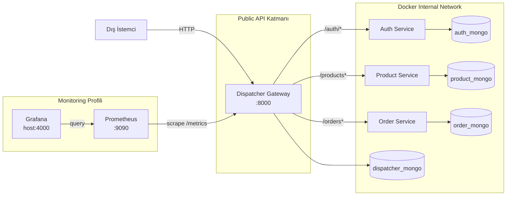
```mermaid
flowchart LR
  Client[Dış İstemci]

  subgraph PublicAPI[Public API Katmanı]
    D[Dispatcher Gateway<br/>:8000]
  end

  subgraph InternalNet[Docker Internal Network]
    A[Auth Service]
    P[Product Service]
    O[Order Service]

    ADM[(auth_mongo)]
    PDM[(product_mongo)]
    ODM[(order_mongo)]
    DDM[(dispatcher_mongo)]
  end

  subgraph Observability[Monitoring Profili]
    PR[Prometheus<br/>:9090]
    GR[Grafana<br/>host:4000]
  end

  Client -->|HTTP| D
  D -->|/auth/*| A
  D -->|/products*| P
  D -->|/orders*| O

  A --> ADM
  P --> PDM
  O --> ODM
  D --> DDM

  PR -->|scrape /metrics| D
  GR -->|query| PR
```

## Mikroservislerin Görevleri
### 1) Dispatcher
- Dış dünyaya açık ana giriş noktasıdır.
- `/auth`, `/products`, `/orders` trafiğini ilgili iç servislere yönlendirir.
- Ürün ve sipariş kaynaklarına gelen isteklerde merkezi yetkilendirme kontrolü uygular.
- Trafik loglarını ve access profile verisini kendi persistence sınırında tutar.
- `/metrics` endpoint'i ile Prometheus uyumlu metrik üretir.

### 2) Auth Service
- Kullanıcı kayıt (`POST /register`) ve giriş (`POST /login`) işlemlerini yönetir.
- JWT token üretir ve token doğrulama (`GET /verify-token`) sağlar.
- Parola hashleme ve parola doğrulama işlemlerini yürütür.

### 3) Product Service
- Ürün CRUD işlemlerini yönetir:
  - `GET /products`
  - `GET /products/{id}`
  - `POST /products`
  - `PUT /products/{id}`
  - `PATCH /products/{id}`
  - `DELETE /products/{id}`

### 4) Order Service
- Sipariş CRUD ve yaşam döngüsü işlemlerini yönetir:
  - `GET /orders`
  - `GET /orders/{id}`
  - `POST /orders`
  - `PATCH /orders/{id}`
  - `DELETE /orders/{id}`
- Sipariş toplam tutarını (`total_amount`) item listesi üzerinden hesaplar.

## Dispatcher/Gateway Mantığı
Dispatcher, iç servisleri dış dünyadan soyutlayan bir API gateway katmanıdır.

Temel davranışlar:
- Route kayıtları merkezi olarak yapılır (`/auth/{path:path}`, `/products`, `/orders`).
- Auth dışındaki protected kaynaklar için token + access profile kontrolü middleware düzeyinde uygulanır.
- Upstream cevaplarının status code ve body semantiği mümkün olduğunca korunur.
- Upstream bağlantı hatalarında `503 Service Unavailable`, beklenmeyen iç hatalarda `500 Internal Server Error` döndürülür.

Haritalama özeti:
| Dış API (Dispatcher) | İç hedef servis |
| --- | --- |
| `/auth/{path}` | `auth_service/{path}` |
| `/products...` | `product_service/products...` |
| `/orders...` | `order_service/orders...` |

## Kimlik Doğrulama ve Yetkilendirme Yapısı
### Kimlik doğrulama (Authentication)
- Kullanıcı `POST /auth/register` ve `POST /auth/login` akışlarıyla token alır.
- Dispatcher üzerinden gelen `/auth/*` çağrıları auth servisine aktarılır.

### Yetkilendirme (Authorization)
- Dispatcher, `/products` ve `/orders` prefix'leri için koruma uygular.
- Authorization header yoksa veya token geçersizse `401 Unauthorized` döner.
- Token geçerli olsa da ilgili kaynak-yöntem izni yoksa `403 Forbidden` döner.
- Access profile verisi dispatcher'ın kendi `access_profiles` koleksiyonunda tutulur.
- Varsayılan yaklaşımda `default-authenticated` profili okuma odaklıdır (GET izinleri).

## Veri Tabanı İzolasyonu
Servisler arasında paylaşılan tek bir veritabanı yerine, her servis için ayrı MongoDB konteyneri tanımlanmıştır.

| Birim | Mongo Servisi | Varsayılan DB adı | Sınır |
| --- | --- | --- | --- |
| Auth Service | `auth_mongo` | `auth_db` | Kimlik verileri |
| Product Service | `product_mongo` | `product_db` | Ürün verileri |
| Order Service | `order_mongo` | `order_db` | Sipariş verileri |
| Dispatcher | `dispatcher_mongo` | `dispatcher_db` | Trafik logları + access profile |

Bu yapı, persistence boundary ilkesini korur ve servisler arası doğrudan veritabanı bağımlılığını engeller.

## Network Isolation
`docker-compose.yml` içinde tüm servisler `internal_network` ağına bağlıdır.

İzolasyon özeti:
- Auth/Product/Order servisleri host port publish etmez.
- Mongo konteynerleri host port publish etmez.
- Business API için dışa açılan tek kapı dispatcher'dır (`8000:8000`).
- Monitoring profili açıldığında Prometheus (`9090`) ve Grafana (`4000 -> 3000`) gözlem amaçlı ayrıca publish edilir.

Bu nedenle iç servisler doğrudan public endpoint gibi tasarlanmamış, gateway arkasında çalışacak şekilde konumlandırılmıştır.

## Docker ve Orkestrasyon Yapısı
Aşağıdaki komutlar Windows PowerShell üzerinde, repo kök dizini `C:\Users\husoelrey\Documents\Projects\product-order-microservices` içinden çalıştırılmıştır.

### Runtime başlatma
```powershell
docker compose -f src/docker-compose.yml up --build
```

Çalışan servislerin Docker Compose üzerindeki durumu aşağıdaki ekran görüntüsünde gösterilmektedir.

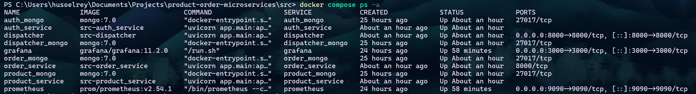

### Monitoring profilini başlatma
```powershell
docker compose -f src/docker-compose.yml --profile monitoring up -d prometheus grafana
```

### Test profilini konteyner üzerinde çalıştırma
```powershell
docker compose -f src/docker-compose.yml --profile test run --rm auth_tests
docker compose -f src/docker-compose.yml --profile test run --rm dispatcher_tests
docker compose -f src/docker-compose.yml --profile test run --rm product_tests
docker compose -f src/docker-compose.yml --profile test run --rm order_tests
```

## API Tasarımı
API tasarımı kaynak odaklıdır ve dispatcher dış sözleşmesi üzerinden birleşik bir yüzey sunar.

Tasarım ilkeleri:
- Kaynak bazlı URL yapıları (`/products`, `/orders`, `/auth/...`)
- HTTP methodlarının amaca uygun kullanımı
- Uygun status code üretimi
- Request/response şemalarında alan doğrulama

## RESTful Yaklaşım
Projedeki yöntem dağılımı REST yaklaşımıyla uyumludur:

- `GET`: listeleme/detay okuma
- `POST`: oluşturma veya auth işlem başlangıcı
- `PUT`: ürün kaynağını tam değiştirme
- `PATCH`: kısmi güncelleme
- `DELETE`: kaynak silme

Durum kodları da davranışa göre ayrıştırılmıştır (200, 201, 204, 401, 403, 404, 409, 422, 500, 503).

## Richardson Maturity Model Seviye 2
Bu proje RMM Seviye 2 beklentisini aşağıdaki şekilde karşılar:

- Tek endpoint üstünden action taşıma yerine kaynak odaklı URI tasarımı vardır.
- Farklı işlevler farklı HTTP methodlarına bölünmüştür.
- Method + status code kombinasyonları semantik farkları yansıtır.

## Literatür ve Karmaşıklık Notları
### Literatür ve tasarım dayanakları
Bu README'deki tasarım kararları ve kavramsal çerçeve aşağıdaki kaynaklara dayandırılmıştır:

- Resmi ders isterleri: `YazLab.docx`
- Resmi hoca açıklamaları: `proje_hakkinda_transkript.txt`
- RMM, REST, Docker Compose, TDD ve mikroservis yaklaşımı için ders dokümanında ekler kısmında önerilen kaynaklar

Bu projede resmi bağlayıcı referans ilk iki belgedir. Diğer kaynaklar, kullanılan mimari kararların kavramsal dayanağını ve terminolojisini netleştirmek için yardımcı literatür olarak kullanılmıştır.

### Karmaşıklık notları
Projede ağır algoritmik işlem yerine ağ yönlendirme, yetkilendirme ve CRUD akışları baskındır. Bu nedenle teorik karmaşıklık yorumları aşağıdaki şekilde özetlenebilir:

- Dispatcher route eşlemesi sabit sayıda kaynak (`/auth`, `/products`, `/orders`) üzerinden çalıştığı için yönlendirme tarafı sabit zamanlıdır; pratik maliyetin ana kısmı upstream ağ gecikmesidir.
- Yetkilendirme kontrolünde protected path kararı sabit prefix kümesine bakar; access profile içindeki izin taraması izin sayısı `p` için `O(p)` düzeyindedir. Mevcut projede `p` küçük ve sınırlıdır.
- Sipariş toplam tutarı hesaplaması item listesi üzerinde tek geçişli toplama ile yapılır; item sayısı `n` için `O(n)` maliyetlidir.
- Listeleme endpoint'lerinde uygulama tarafı maliyet, döndürülen kayıt sayısı `k` ile artar; gerçek darboğaz çoğunlukla veritabanı I/O ve ağ aktarımıdır.

Bu teorik notlar, aşağıdaki load test ve monitoring çıktılarıyla birlikte okunmalıdır; projede performans değerlendirmesi yalnızca Big-O yorumu ile değil, ölçülen gecikme ve failure oranları ile de desteklenmiştir.

## Servis Endpoint Özeti
### Dış sözleşme (dispatcher üzerinden)
| Method | Endpoint | Açıklama |
| --- | --- | --- |
| GET | `/` | Dispatcher sağlık mesajı |
| GET | `/metrics` | Prometheus metrik endpoint'i |
| GET/POST/PUT/PATCH/DELETE | `/auth/{path}` | Auth servisine proxy |
| GET | `/products` | Ürün listesi |
| POST | `/products` | Ürün oluşturma |
| GET | `/products/{id}` | Ürün detayı |
| PUT | `/products/{id}` | Ürün tam güncelleme |
| PATCH | `/products/{id}` | Ürün kısmi güncelleme |
| DELETE | `/products/{id}` | Ürün silme |
| GET | `/orders` | Sipariş listesi |
| POST | `/orders` | Sipariş oluşturma |
| GET | `/orders/{id}` | Sipariş detayı |
| PATCH | `/orders/{id}` | Sipariş kısmi güncelleme |
| DELETE | `/orders/{id}` | Sipariş silme |

### İç servis endpointleri (internal kullanım)
| Servis | Endpointler |
| --- | --- |
| Auth Service | `POST /register`, `POST /login`, `GET /verify-token` |
| Product Service | `GET/POST /products`, `GET/PUT/PATCH/DELETE /products/{id}` |
| Order Service | `GET/POST /orders`, `GET/PATCH/DELETE /orders/{id}` |

### Status code davranış özeti
| Kod | Anlam | Tipik senaryo |
| --- | --- | --- |
| 200 | Başarılı işlem | Listeleme, detay, login |
| 201 | Kaynak oluşturuldu | Ürün/sipariş oluşturma |
| 204 | Gövdesiz başarılı silme | Silme işlemleri |
| 401 | Kimlik doğrulama başarısız | Token yok/geçersiz |
| 403 | Yetki yetersiz | Token geçerli ama izin yok |
| 404 | Kaynak bulunamadı | Geçersiz id veya yanlış route |
| 405 | Method desteklenmiyor | Kaynak için tanımsız method |
| 409 | Çakışma | Aynı kullanıcı adıyla tekrar kayıt |
| 422 | Doğrulama hatası | Şema/field doğrulama hatası |
| 500 | İç hata | Beklenmeyen dispatcher iç hatası |
| 503 | Servis erişilemiyor | Upstream bağlantı problemi |

## Katmanlı Mimari Açıklaması
Projede katmanlar servis bazında ayrılmıştır:

- Router/Controller katmanı: HTTP endpoint tanımı ve hata kodu dönüşleri
- Service katmanı: iş kuralları ve akış yönetimi
- Repository katmanı: veritabanı erişimi
- Schema katmanı: veri doğrulama sözleşmesi
- Model katmanı: domain nesneleri
- Core katmanı: güvenlik, metrik, veritabanı bağlantısı gibi ortak altyapı

Bu ayrım, business logic'in route fonksiyonlarına gömülmesini engeller ve test edilebilirliği artırır.

## Sınıf/Katman Yapısı
Aşağıdaki UML sınıf diyagramı, projedeki gerçek sınıfları ve protocol/tabanlı bağımlılıkları özetlemektedir. Router katmanı FastAPI üzerinde fonksiyon tabanlı route handler'larla kurulduğu için bu diyagramda özellikle service, repository, model ve dispatcher yardımcı sınıfları gösterilmiştir.

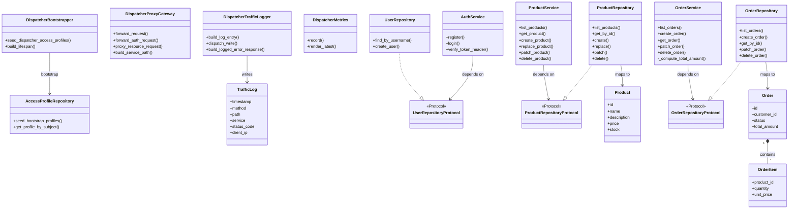
```mermaid
classDiagram
  class DispatcherBootstrapper {
    +seed_dispatcher_access_profiles()
    +build_lifespan()
  }

  class AccessProfileRepository {
    +seed_bootstrap_profiles()
    +get_profile_by_subject()
  }

  class DispatcherProxyGateway {
    +forward_request()
    +forward_auth_request()
    +proxy_resource_request()
    +build_service_path()
  }

  class DispatcherTrafficLogger {
    +build_log_entry()
    +dispatch_write()
    +build_logged_error_response()
  }

  class DispatcherMetrics {
    +record()
    +render_latest()
  }

  class TrafficLog {
    +timestamp
    +method
    +path
    +service
    +status_code
    +client_ip
  }

  class UserRepositoryProtocol {
    <<Protocol>>
  }

  class AuthService {
    +register()
    +login()
    +verify_token_header()
  }

  class UserRepository {
    +find_by_username()
    +create_user()
  }

  class ProductRepositoryProtocol {
    <<Protocol>>
  }

  class ProductService {
    +list_products()
    +get_product()
    +create_product()
    +replace_product()
    +patch_product()
    +delete_product()
  }

  class ProductRepository {
    +list_products()
    +get_by_id()
    +create()
    +replace()
    +patch()
    +delete()
  }

  class Product {
    +id
    +name
    +description
    +price
    +stock
  }

  class OrderRepositoryProtocol {
    <<Protocol>>
  }

  class OrderService {
    +list_orders()
    +create_order()
    +get_order()
    +patch_order()
    +delete_order()
    -_compute_total_amount()
  }

  class OrderRepository {
    +list_orders()
    +create_order()
    +get_by_id()
    +patch_order()
    +delete_order()
  }

  class Order {
    +id
    +customer_id
    +status
    +total_amount
  }

  class OrderItem {
    +product_id
    +quantity
    +unit_price
  }

  DispatcherBootstrapper --> AccessProfileRepository : bootstrap
  DispatcherTrafficLogger --> TrafficLog : writes
  UserRepository ..|> UserRepositoryProtocol
  AuthService --> UserRepositoryProtocol : depends on
  ProductRepository ..|> ProductRepositoryProtocol
  ProductService --> ProductRepositoryProtocol : depends on
  ProductRepository --> Product : maps to
  OrderRepository ..|> OrderRepositoryProtocol
  OrderService --> OrderRepositoryProtocol : depends on
  OrderRepository --> Order : maps to
  Order "1" *-- "*" OrderItem : contains
```

## İstek Akışları
### Akış 1: Login
1. İstemci dispatcher üzerinden `/auth/login` çağrısı yapar.
2. Dispatcher isteği auth servisine iletir.
3. Auth servis kimlik bilgilerini doğrular, token üretir.
4. Dispatcher yanıtı istemciye döndürür.

### Akış 2: Yetkili ürün okuma
1. İstemci `Authorization: Bearer <token>` ile `/products` çağrısı yapar.
2. Dispatcher token ve access profile kontrolü yapar.
3. Yetki uygunsa product service'e iletir.
4. Ürün listesi yanıtını istemciye döndürür.

### Akış 3: Yetkisiz yazma isteği
1. İstemci geçerli ama yazma izni olmayan token ile `POST /products` çağırır.
2. Dispatcher erişim profilinde method iznini kontrol eder.
3. İzin yoksa isteği aşağı servise iletmeden `403 Forbidden` döndürür.

### Akış 4: Upstream servis kesintisi
1. İstemci protected endpoint çağırır.
2. Dispatcher yetki kontrolünden sonra ilgili servise iletmek ister.
3. Upstream erişilemiyorsa `503 Service Unavailable` döndürülür.

## Sequence Diagramlar
### Sequence Diagram 1: Login ve token alma
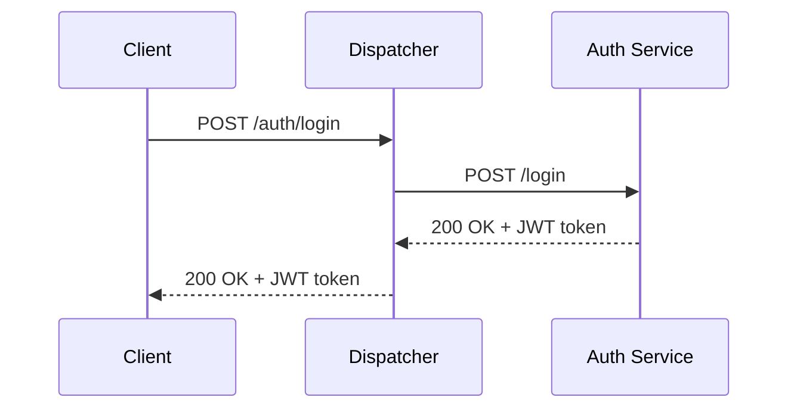
```mermaid
sequenceDiagram
  participant C as Client
  participant D as Dispatcher
  participant A as Auth Service

  C->>D: POST /auth/login
  D->>A: POST /login
  A-->>D: 200 OK + JWT token
  D-->>C: 200 OK + JWT token
```

### Sequence Diagram 2: Protected ürün yazma isteğinde yetki kontrolü
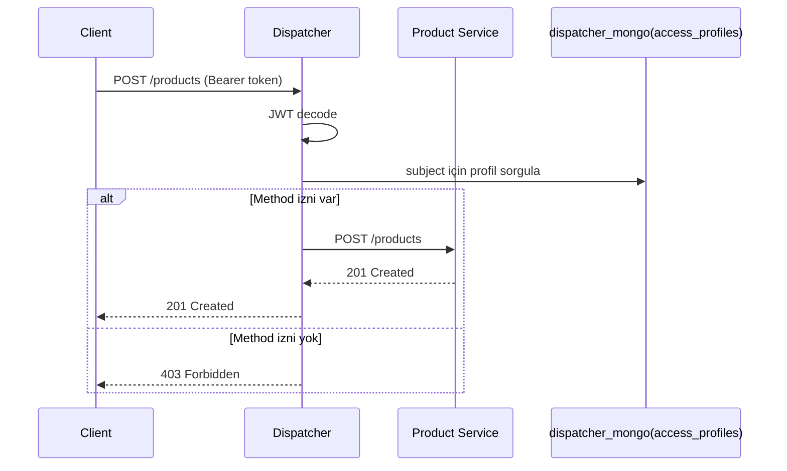
```mermaid
sequenceDiagram
  participant C as Client
  participant D as Dispatcher
  participant P as Product Service
  participant DB as dispatcher_mongo(access_profiles)

  C->>D: POST /products (Bearer token)
  D->>D: JWT decode
    D->>DB: subject için profil sorgula
  alt Method izni var
    D->>P: POST /products
    P-->>D: 201 Created
    D-->>C: 201 Created
  else Method izni yok
    D-->>C: 403 Forbidden
  end
```

## Test Yaklaşımı
Projede test yaklaşımı katmanlı ve davranış odaklıdır:

- Servis testlerinde fake collection kullanılarak veritabanı bağımlılığı azaltılmıştır.
- Dispatcher testlerinde authz, proxy forwarding, hata semantiği, logging ve metrics davranışları doğrulanmıştır.
- Product ve Order servislerinde CRUD akışları ve 404/204 gibi durum kodları test edilmektedir.
- Auth servisinde register/login/verify-token temel akışları test edilmektedir.

Not:
- Dispatcher tarafında belirgin bir TDD akışı commit geçmişinde izlenebilmektedir.
- Tüm proje genelinde aynı yoğunlukta kesintisiz bir TDD zinciri bulunmamaktadır.

## Dispatcher Tarafında TDD Uygulaması
Dispatcher geliştirmelerinde commit geçmişinde Red -> Green -> Refactor örüntüsü gözlenmektedir.

Örnek TDD döngüleri:
- Upstream `503` semantiği
  - `7873d5e` test(dispatcher): red upstream failure returns 503
  - `ce856a6` feat(dispatcher): green upstream failure returns 503
  - `173c85a` refactor(dispatcher): polish upstream handling
- Internal `500` semantiği
  - `1741470` test(dispatcher): red internal dispatcher error returns 500
  - `1c64eac` feat(dispatcher): green internal dispatcher error returns 500
  - `e7e0b1b` refactor(dispatcher): polish internal error handling
- Route guard doğrulaması
  - `662d8b3` test(dispatcher): red exact protected route matching
  - `35f93b9` feat(dispatcher): green exact protected route matching
  - `f2c0d50` refactor(dispatcher): polish protected route matching
- Prometheus metrikleri
  - `254317d` test(dispatcher): red prometheus request metrics
  - `91a0442` feat(dispatcher): green prometheus request metrics
  - `3e87201` refactor(dispatcher): polish metrics instrumentation

## Commit / TDD Geçmişi İçin Örnek Commit Akışı
| Akış | Test (Red) | Uygulama (Green) | Refactor |
| --- | --- | --- | --- |
| Upstream hata yönetimi | `7873d5e` | `ce856a6` | `173c85a` |
| Internal hata yönetimi | `1741470` | `1c64eac` | `e7e0b1b` |
| Route guard doğruluğu | `662d8b3` | `35f93b9` | `f2c0d50` |
| Dispatcher metrikleri | `254317d` | `91a0442` | `3e87201` |

## Git Katkı Dağılımı
Bu raporda katkı dağılımı değerlendirmesi, aktif `HEAD` (`main`) geçmişi üzerinden alınmıştır.

| Ekip üyesi | Commit sayısı | Yaklaşık oran |
| --- | --- | --- |
| Hüseyin Erekmen | 86 | %51 |
| Rana Karagöl | 80 | %49 |

Bu dağılım, iki ekip üyesinin de aktif ana geçmişte dengeli katkı verdiğini göstermektedir. Tüm branchler dahil edildiğinde toplam commit sayıları farklılaşabilse de, sunum ve rapor bağlamında esas alınan görünüm aktif teslim geçmişidir.

## Monitoring ve Görselleştirme
Projede monitoring katmanı Prometheus + Grafana ile yapılandırılmıştır.

### Prometheus'un rolü
- Dispatcher'ın `/metrics` endpoint'ini scrape ederek metrik toplar.
- Gateway üzerinde oluşan request sayıları, status code dağılımı ve latency histogramlarını sorgulanabilir hale getirir.

### Grafana dashboard'un rolü
Provision edilen `Dispatcher Overview` dashboard'u aşağıdaki panelleri içerir:
- `Requests (15m)`
- `Status Codes (15m)`
- `Request Latency P95`

### Monitoring Çıktıları
Grafana ve Prometheus üzerinden elde edilen izleme çıktıları aşağıda verilmiştir.

#### Grafana dashboard görünümü
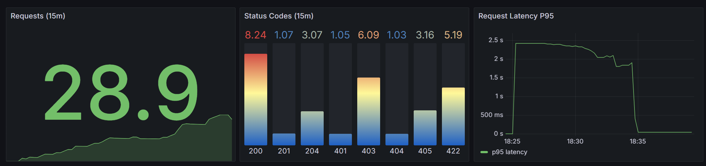

#### Prometheus target health
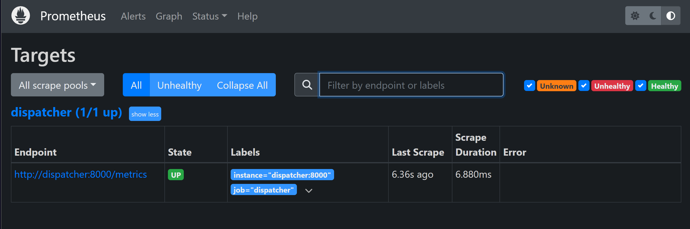

#### Prometheus status code sorgusu
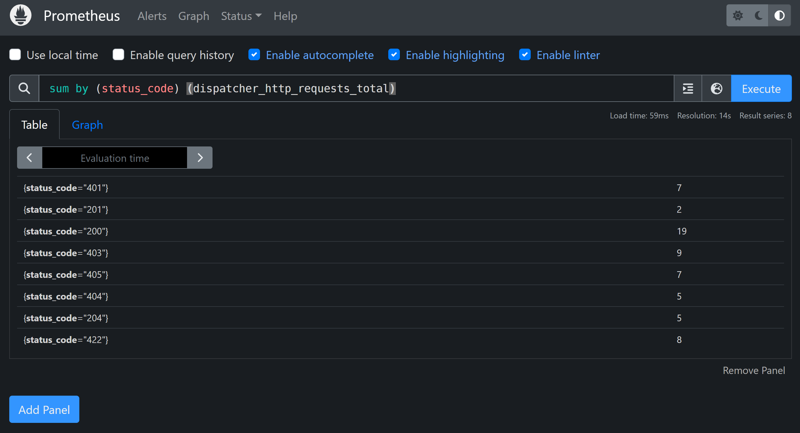

#### Dashboard değerlendirmesi
- Grafana dashboard'u istek hacmi, durum kodları ve gecikme metriklerini tek ekranda göstermektedir.
- Prometheus target ekranı dispatcher `/metrics` endpoint'inin başarıyla scrape edildiğini doğrulamaktadır.
- Prometheus status code sorguları, metrik akışının sağlıklı toplandığını ve farklı durum kodlarının gözlenebildiğini göstermektedir.
- Bu sorgudaki değerler toplam sayaç (counter) olduğundan, tek başına ana performans benchmark metriği olarak değil destekleyici gözlem olarak yorumlanmıştır.

### Dispatcher log tablosu
Dispatcher üzerindeki trafik kayıtları, `dispatcher_db` içindeki `traffic_logs` koleksiyonunda tutulmaktadır. Aşağıdaki tablo görüntüsü, farklı istek türlerinin merkezi olarak izlenebildiğini göstermektedir.

Tabloyu üretmek için kullanılan sorgu:

```powershell
docker exec dispatcher_mongo mongosh --% "mongodb://localhost:27017/dispatcher_db" --quiet --eval "console.table(db.traffic_logs.find({path: {$ne: '/metrics'}}, {_id:0, timestamp:1, method:1, path:1, service:1, status_code:1, client_ip:1}).sort({timestamp:-1}).limit(20).toArray())"
```

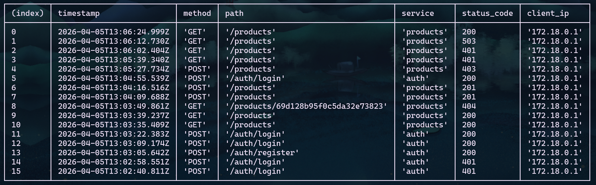

Tabloda görülen temel alanlar:
- `timestamp`
- `method`
- `path`
- `service`
- `status_code`
- `client_ip`

Bu log görünümü içinde başarılı istekler (`200`, `201`) ile birlikte yetkisiz erişim (`401`), yetki yetersizliği (`403`), kaynak bulunamadı (`404`) ve upstream servis erişim problemi (`503`) aynı koleksiyonda gözlenebilmektedir. Bu görüntüde `/metrics` kayıtları özellikle filtrelenmiştir; böylece business API trafiği daha okunabilir hale getirilmiştir.

### Postman / Manuel API Çıktıları

#### Login isteği
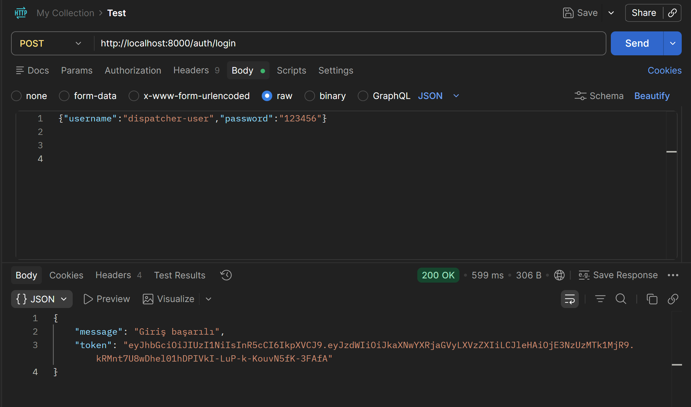

#### Başarılı silme işlemi (`204 No Content`)
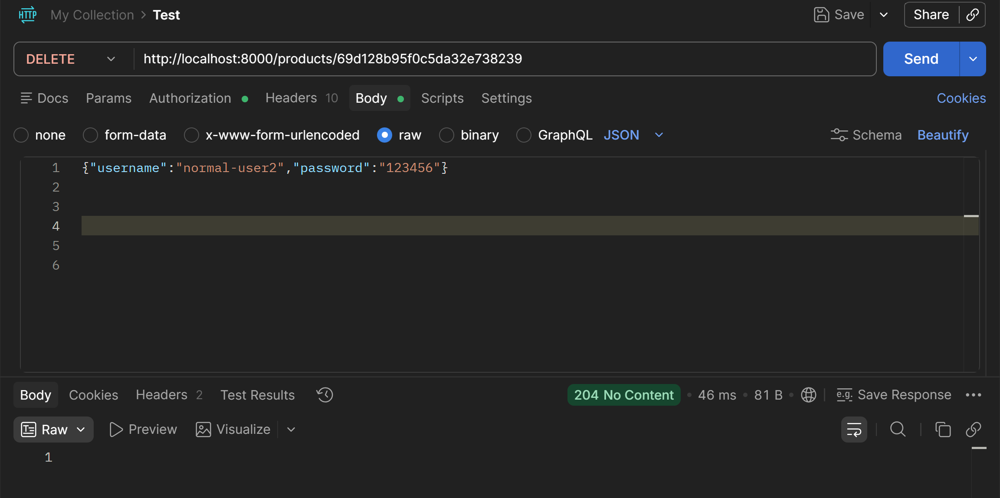

#### Yetkisiz istek (`401 Unauthorized`)
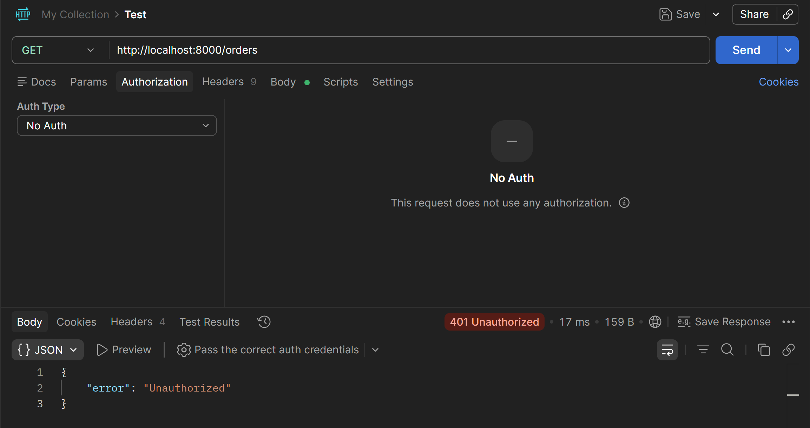

#### Yetki yetersiz istek (`403 Forbidden`)
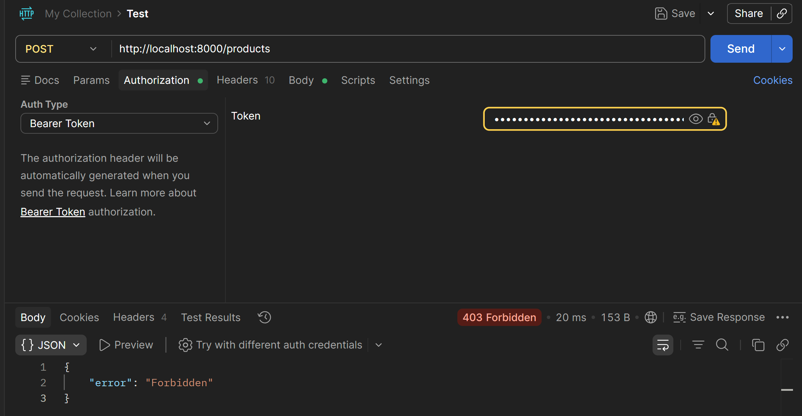

#### Kaynak bulunamadı (`404 Not Found`)
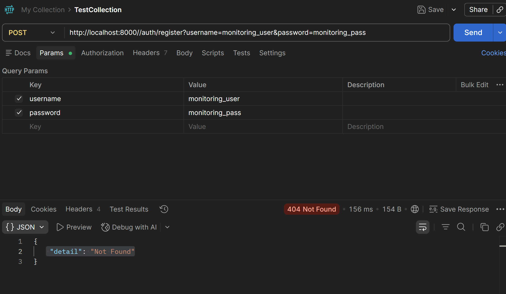

## Yük Testi (Locust)
Locust ile dispatcher/gateway üzerine eşzamanlı trafik üretilmiş; her senaryoda Locust istatistikleri, Grafana paneli ve Prometheus status code sorgusu birlikte kaydedilmiştir.

### Locust çalıştırma komutları (PowerShell)
Aşağıdaki komutlar repo kök dizininden çalıştırılmak üzere kullanılmıştır:

```powershell
python -m locust -f .\load_tests\locustfile.py --host http://localhost:8000
```

Headless örnek benchmark komutu:

```powershell
python -m locust -f .\load_tests\locustfile.py --host http://localhost:8000 --headless --users 100 --spawn-rate 10 --run-time 3m
```

### Kısa Metodoloji
- Testler artımlı olarak 20, 50, 100 ve 300 kullanıcı seviyelerinde çalıştırılmıştır.
- Ana karşılaştırma benchmark seti 20/50/100 kullanıcı senaryolarıdır.
- 300 kullanıcı seviyesi ayrı bir ek stres testi olarak değerlendirilmiştir.
- Performans karşılaştırmasında Locust `Aggregated` satırı temel alınmıştır.
- Prometheus status code sorguları toplam sayaç ürettiği için ana benchmark metriği olarak değil destekleyici gözlem verisi olarak kullanılmıştır.

### Ana Karşılaştırma Tablosu (20 / 50 / 100)
| Test | Users | Spawn Rate | Total Requests | Failures | Failure Rate | Average | Median | P95 | P99 | Current RPS | Değerlendirme |
| --- | --- | --- | --- | --- | --- | --- | --- | --- | --- | --- | --- |
| 20 Kullanıcı | 20 | 2 kullanıcı/s | 1842 | 0 | %0 | 15.38 ms | 13 ms | 24 ms | 110 ms | 9.2 | Stabil ve düşük gecikmeli başlangıç seviyesi. |
| 50 Kullanıcı | 50 | 5 kullanıcı/s | 4604 | 0 | %0 | 15.54 ms | 12 ms | 24 ms | 140 ms | 26.8 | Throughput artarken sistem stabil kalıyor. |
| 100 Kullanıcı | 100 | 10 kullanıcı/s | 9206 | 0 | %0 | 17.10 ms | 11 ms | 34 ms | 170 ms | 49.8 | Yük altında kararlı davranan güçlü seviye. |

### 20 Kullanıcılı Test
Kurulum parametreleri:
- Users: 20
- Spawn rate: 2 kullanıcı/saniye
- Host: `http://host.docker.internal:8000`

İlgili ekran görüntüleri:

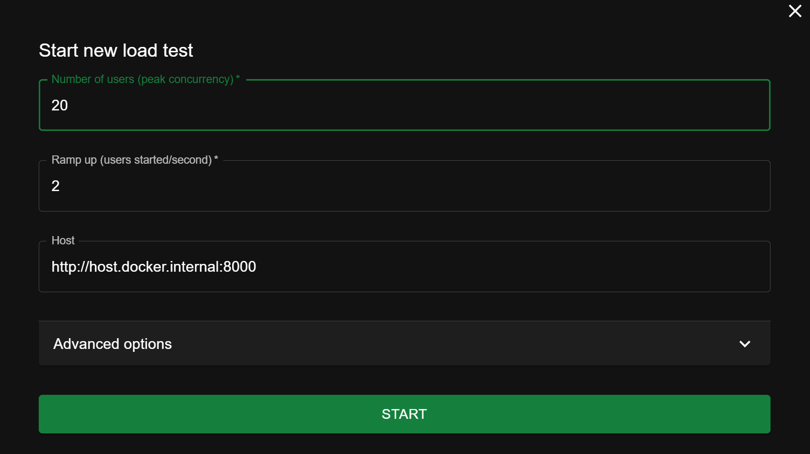

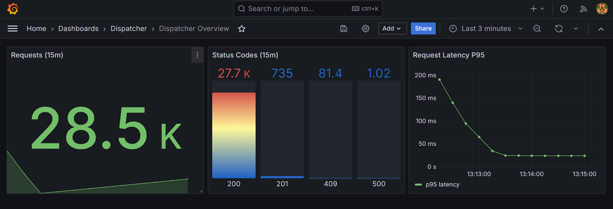
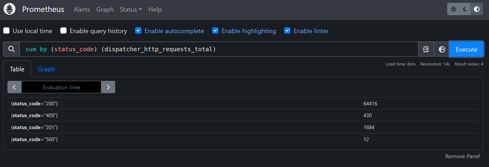

Locust `Aggregated` bulguları:
- Total requests: 1842
- Failures: 0 (%0)
- Average: 15.38 ms
- Median: 13 ms
- P95: 24 ms
- P99: 110 ms
- Current RPS: 9.2

Endpoint gözlemleri:
- Okuma endpoint'leri düşük gecikmede kalmıştır (`GET /products` ort. 12.36 ms, `GET /orders` ort. 15.65 ms).
- Auth endpoint'leri daha yavaştır (`POST /auth/login` ort. 118.96 ms, `POST /auth/register` ort. 64.32 ms).

### 50 Kullanıcılı Test
Kurulum parametreleri:
- Users: 50
- Spawn rate: 5 kullanıcı/saniye
- Host: `http://host.docker.internal:8000`

İlgili ekran görüntüleri:

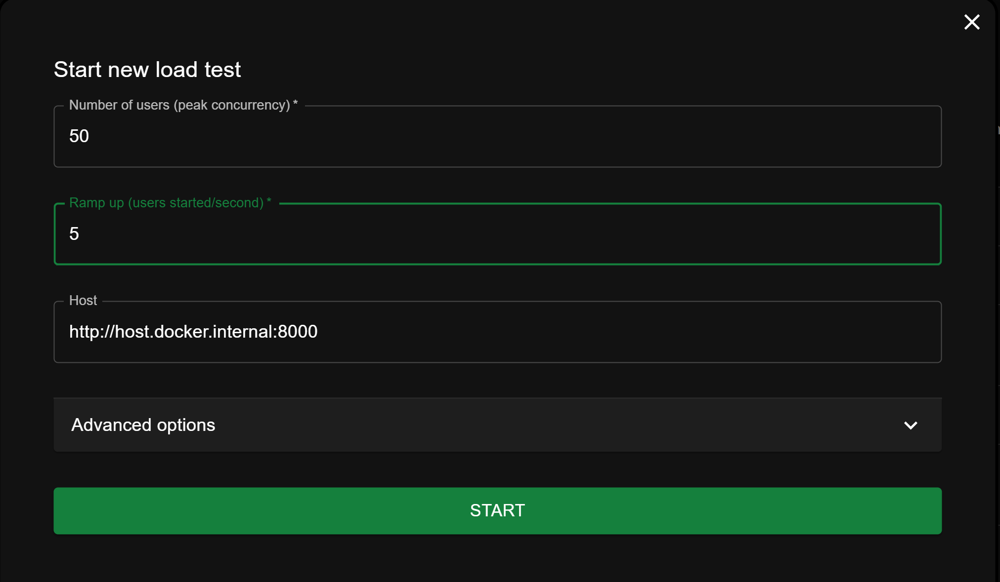
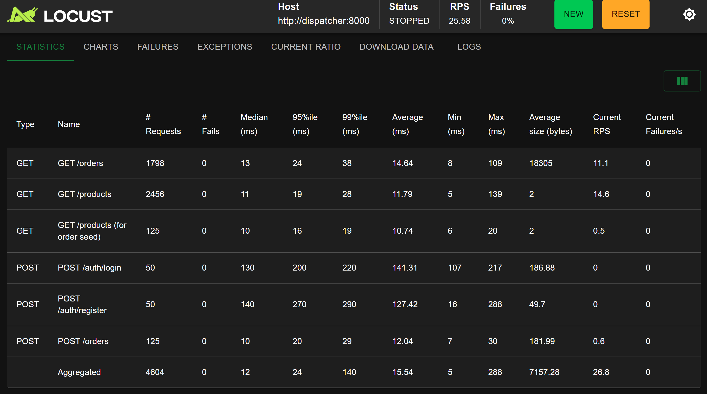
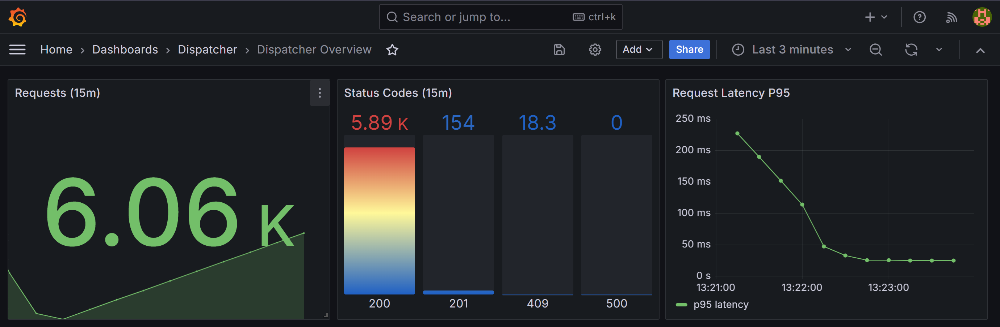


Locust `Aggregated` bulguları:
- Total requests: 4604
- Failures: 0 (%0)
- Average: 15.54 ms
- Median: 12 ms
- P95: 24 ms
- P99: 140 ms
- Current RPS: 26.8

Endpoint gözlemleri:
- Okuma endpoint'leri düşük gecikme bandını korumuştur (`GET /products` ort. 11.79 ms, `GET /orders` ort. 14.64 ms).
- Auth endpoint'leri yine daha yavaştır (`POST /auth/login` ort. 141.31 ms, `POST /auth/register` ort. 127.42 ms).

### 100 Kullanıcılı Test
Kurulum parametreleri:
- Users: 100
- Spawn rate: 10 kullanıcı/saniye
- Host: `http://host.docker.internal:8000`

İlgili ekran görüntüleri:

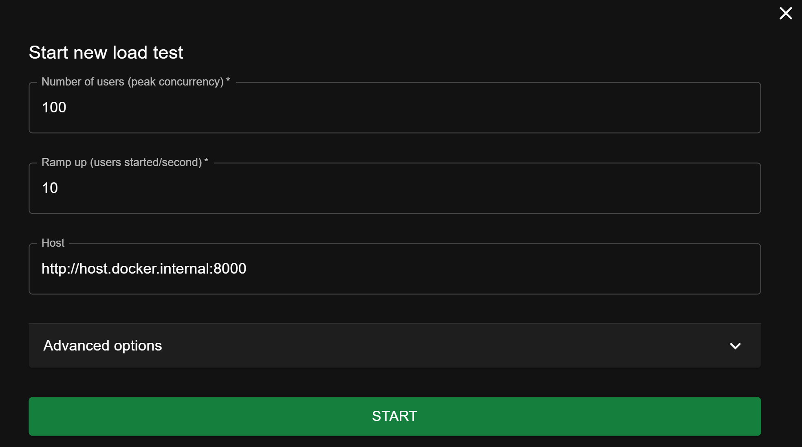
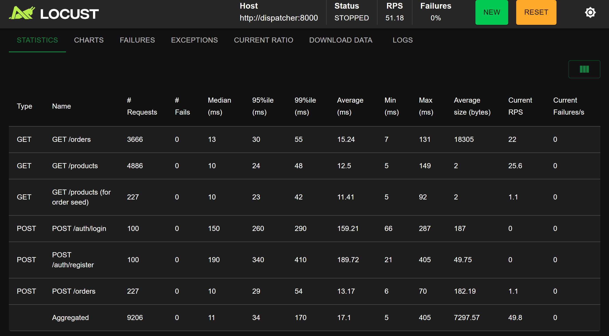
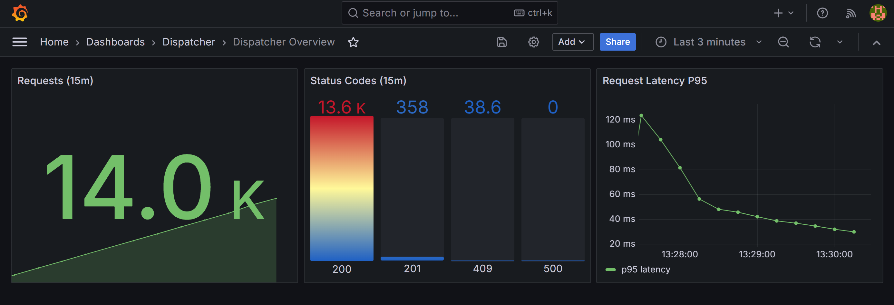
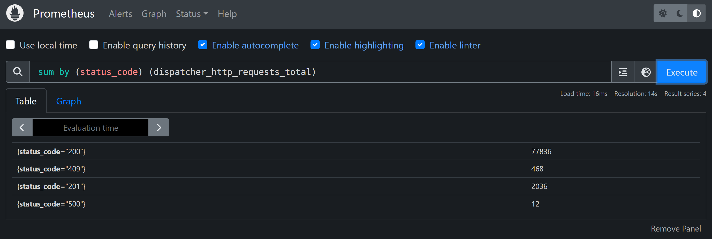

Locust `Aggregated` bulguları:
- Total requests: 9206
- Failures: 0 (%0)
- Average: 17.10 ms
- Median: 11 ms
- P95: 34 ms
- P99: 170 ms
- Current RPS: 49.8

Endpoint gözlemleri:
- Okuma endpoint'leri stabil kalmıştır (`GET /products` ort. 12.50 ms, `GET /orders` ort. 15.24 ms).
- Auth endpoint'leri bu seviyede de daha yavaştır (`POST /auth/login` ort. 159.21 ms, `POST /auth/register` ort. 189.72 ms).

100 kullanıcı seviyesinde failure oranının %0 kalması ve P95/P99 değerlerinin kontrol altında seyretmesi, bu yük seviyesinde sistemin kararlı davrandığını göstermektedir.

### 300 Kullanıcılı Ek Stres Testi
Kurulum parametreleri:
- Users: 300
- Spawn rate: 20 kullanıcı/saniye
- Host: `http://dispatcher:8000`

İlgili ekran görüntüleri:

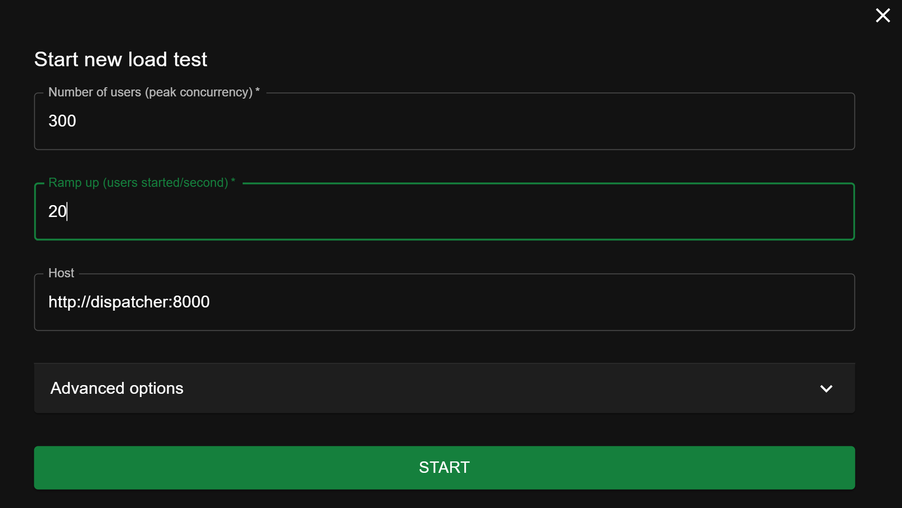

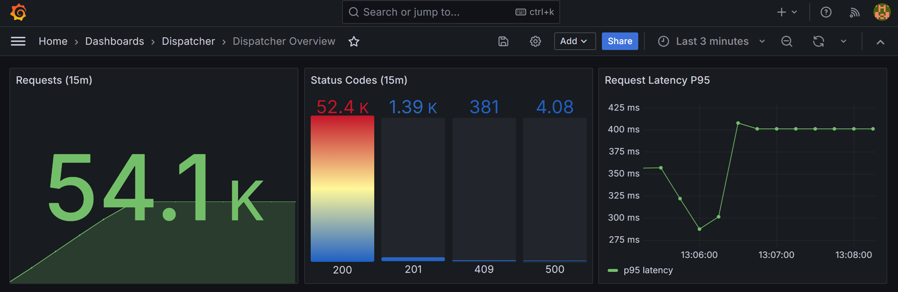


Locust `Aggregated` bulguları:
- Total requests: 26215
- Failures: 0 (%0)
- Average: 90.82 ms
- Median: 24 ms
- P95: 400 ms
- P99: 1100 ms
- Current RPS: 118.2

Endpoint gözlemleri:
- Auth endpoint'leri belirgin şekilde yükselmiştir (`POST /auth/login` ort. 319.83 ms, `POST /auth/register` ort. 409.14 ms).
- Okuma endpoint'lerinde de gecikme artışı gözlenmiştir (`GET /products` ort. 91.84 ms, `GET /orders` ort. 76.02 ms).

Bu seviyede sistem hata üretmeden çalışmaya devam etmiştir; ancak latency belirgin şekilde yükselmiştir. Bu nedenle 300 kullanıcı senaryosu, ana benchmark karşılaştırmasından ayrı tutulmuş ve sistemin daha yüksek yük altındaki davranışını gözlemlemek için ek stres testi olarak kullanılmıştır.

### Kısa Genel Değerlendirme
- 20/50/100 kullanıcı testleri güçlü ve stabil bir davranış göstermiştir.
- Ana benchmark setinde failure oranı %0 olarak korunmuştur.
- Auth endpoint'leri tüm seviyelerde diğer endpoint'lere göre daha yüksek gecikme üretmektedir.
- 100 kullanıcı seviyesi, bu proje için en güçlü ana yük testi seviyesi olarak öne çıkmaktadır.
- 300 kullanıcı seviyesinde sistem çökmemiştir; fakat gecikme artışı belirgindir ve bu test dayanıklılık gözlemi olarak değerlendirilmelidir.

## Başarılar
- Ders isterindeki minimum 4 bağımsız birim mimarisi sağlanmıştır.
- Dispatcher business API için merkezi giriş noktası olarak konumlandırılmıştır.
- Dispatcher/Auth/Product/Order için ayrı NoSQL persistence sınırları oluşturulmuştur.
- Merkezi yetkilendirme kontrolü dispatcher katmanında uygulanmıştır.
- Dispatcher için metrik üretimi ve dashboard altyapısı kurulmuştur.
- Servislerde katmanlı yapı (router/service/repository/schema/model) belirgin hale getirilmiştir.
- Locust ile 20/50/100 kullanıcı benchmark testleri ve 300 kullanıcı ek stres testi uygulanmıştır.
- Prometheus ve Grafana üzerinden yük altındaki davranış gözlemlenmiş ve raporlanmıştır.

## Sınırlılıklar
- Ana benchmark karşılaştırması 20/50/100 kullanıcı seviyelerine odaklanmıştır; 300 kullanıcı testi karşılaştırma tablosundan ayrı, ek stres testi amacıyla değerlendirilmiştir.
- 300 kullanıcı seviyesinin üzerinde (ör. 500+) ek kırılma/kapasite testleri bu rapor kapsamında yapılmamıştır.
- Authentication endpoint'lerinde diğer endpoint'lere göre daha yüksek gecikme gözlenmiştir.
- Testler ders projesi kapsamındaki senaryolar için hazırlanmıştır; tam ölçekli üretim yükünü temsil etmemektedir.
- Dispatcher tarafında TDD geçmişi daha belirgindir; tüm servislerde aynı düzeyde commit tabanlı TDD zinciri gösterilmemektedir.
- Dispatcher route tanımları bazı path kombinasyonlarında aşağı servisten `405` dönebilecek şekilde geniş method kaydına sahiptir.
- Tam kapsamlı uçtan uca entegrasyon senaryoları için ek test genişletme ihtiyacı devam etmektedir.

## Olası Geliştirmeler
- Auth doğrulama çağrılarını dispatcher içinde daha ileri policy katmanına dönüştürmek
- Access profile yönetimi için admin endpointleri ve audit trail genişletmek
- Order servisi için durum geçiş kurallarını (state machine yaklaşımı) detaylandırmak
- Distributed tracing (request-id, correlation-id) ve merkezi log toplama entegrasyonu eklemek
- Locust senaryolarını role-based trafik desenleriyle çeşitlendirmek
- CI pipeline'da test + static analysis + container smoke test adımlarını zorunlu hale getirmek

## Sonuç
Bu proje, mikroservis sınırlarını ve gateway yaklaşımını ders isterleriyle uyumlu şekilde uygulayan bir backend iskeleti ortaya koymaktadır. Mevcut durumda dispatcher merkezli yönlendirme, authz kontrolü, servis bazlı persistence izolasyonu, gözlemlenebilirlik altyapısı ve test temelli geliştirme pratiği (özellikle dispatcher tarafında) somut biçimde mevcuttur.
