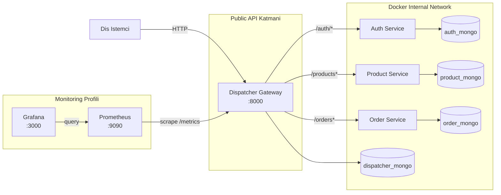

# Product-Order Microservices Projesi

## Proje Adı
Product-Order Microservices

## Ekip Üyeleri
| Ad Soyad | Teknik Rol | Öğrenci No |
| --- | --- | --- |
| Hüseyin Erekmen | Dispatcher, Monitoring, Entegrasyon | TODO: Buraya öğrenci numarası eklenecek |
| Rana Karagöl | Auth/Product/Order servis geliştirme, test | TODO: Buraya öğrenci numarası eklenecek |
| TODO: Buraya varsa ek ekip üyesi eklenecek | TODO: Rol bilgisi eklenecek | TODO: Buraya öğrenci numarası eklenecek |

## Tarih
03 Nisan 2026

## İçindekiler
1. [Giriş](#giriş)
2. [Problemin Tanımı](#problemin-tanımı)
3. [Projenin Amacı](#projenin-amacı)
4. [Kullanılan Teknolojiler](#kullanılan-teknolojiler)
5. [Sistem Mimarisi](#sistem-mimarisi)
6. [Mikroservislerin Görevleri](#mikroservislerin-görevleri)
7. [Dispatcher/Gateway Mantığı](#dispatchergateway-mantığı)
8. [Kimlik Doğrulama ve Yetkilendirme Yapısı](#kimlik-doğrulama-ve-yetkilendirme-yapısı)
9. [Veri Tabanı İzolasyonu](#veri-tabanı-izolasyonu)
10. [Network Isolation](#network-isolation)
11. [Docker ve Orkestrasyon Yapısı](#docker-ve-orkestrasyon-yapısı)
12. [API Tasarımı](#api-tasarımı)
13. [RESTful Yaklaşım](#restful-yaklaşım)
14. [Richardson Maturity Model Seviye 2](#richardson-maturity-model-seviye-2)
15. [Servis Endpoint Özeti](#servis-endpoint-özeti)
16. [Katmanlı Mimari Açıklaması](#katmanlı-mimari-açıklaması)
17. [Sınıf/Katman Yapısı](#sınıfkatman-yapısı)
18. [İstek Akışları](#istek-akışları)
19. [Sequence Diagramlar](#sequence-diagramlar)
20. [Test Yaklaşımı](#test-yaklaşımı)
21. [Dispatcher Tarafında TDD Uygulaması](#dispatcher-tarafında-tdd-uygulaması)
22. [Commit/TDD Kanıtı İçin Örnek Commit Akışı](#committdd-kanıtı-için-örnek-commit-akışı)
23. [Monitoring ve Görselleştirme](#monitoring-ve-görselleştirme)
24. [Yük Testi (Locust)](#yük-testi-locust)
25. [Başarılar](#başarılar)
26. [Sınırlılıklar](#sınırlılıklar)
27. [Olası Geliştirmeler](#olası-geliştirmeler)
28. [Sonuç](#sonuç)

## Giriş
Bu çalışma, ders isterlerine uygun şekilde tasarlanan bir mikroservis mimarisi raporudur. Sistem, dış istemciler için tek giriş noktası olan bir dispatcher (gateway) üzerinden çalışır ve auth, product, order servislerini bu katman üzerinden erişilebilir hale getirir.

Raporun amacı, mevcut repo durumunu teknik olarak doğru, savunulabilir ve dürüst biçimde belgelemektir. Bu nedenle mevcut kod tabanında doğrulanmayan hiçbir sonuç kesin gerçekleşmiş gibi yazılmamıştır.

## Problemin Tanımı
Tek uygulama yaklaşımında kimlik doğrulama, ürün yönetimi, sipariş yönetimi ve yönlendirme sorumlulukları aynı kod tabanında birleştiğinde aşağıdaki problemler oluşur:

- Sorumlulukların karışması ve bakım maliyetinin artması
- Güvenlik ve yetkilendirme kontrollerinin dağınık uygulanması
- Performans ve gözlemlenebilirlik ölçümlerinin merkezi toplanamaması
- Servislerin bağımsız ölçeklenememesi
- Tek veritabanı bağımlılığı nedeniyle sınırların zayıflaması

Bu proje, bu problemleri mikroservis sınırları ve merkezi dispatcher yaklaşımı ile çözmeyi hedeflemektedir.

## Projenin Amacı
Projenin ana amaçları aşağıdaki gibidir:

- En az 4 bağımsız birimden oluşan bir mimari kurmak: dispatcher, auth service, product service, order service
- Dispatcher'ı sistemin tek business API giriş noktası olarak konumlandırmak
- Her birimin kendi NoSQL persistence sınırına sahip olmasını sağlamak
- RESTful ve RMM Seviye 2 uyumlu endpoint sözleşmeleri uygulamak
- Dispatcher tarafında TDD kanıtını commit geçmişi ile savunulabilir hale getirmek
- Monitoring (Prometheus + Grafana) ve yük testi (Locust) için raporlanabilir bir zemin hazırlamak

## Kullanılan Teknolojiler
| Kategori | Teknoloji | Bu projedeki kullanım amacı |
| --- | --- | --- |
| Backend çatısı | FastAPI | HTTP API geliştirme, route tanımlama, validation entegrasyonu |
| Programlama dili | Python 3.11 | Servis geliştirme, iş kuralları, testler |
| Doğrulama modeli | Pydantic | Request/response şemaları ve alan doğrulama |
| Veritabanı | MongoDB | Her servis için ayrı NoSQL persistence |
| Mongo istemcisi | Motor (AsyncIOMotorClient) | Asenkron veri erişimi |
| Containerization | Docker | Servisleri izole çalıştırma |
| Orkestrasyon | Docker Compose | Çoklu servis ve profil yönetimi |
| Test | Pytest | Servis ve dispatcher davranış testleri |
| HTTP istemci | httpx | Dispatcher proxy ve test istemcisi |
| Kimlik doğrulama | python-jose, bcrypt | JWT üretimi/doğrulama ve parola hashleme |
| Gözlemlenebilirlik | Prometheus, Grafana | Metrik toplama ve dashboard görselleştirme |

## Sistem Mimarisi
Sistemin genel topolojisi aşağıdaki gibidir:



## Mikroservislerin Görevleri
### 1) Dispatcher
- Dış dünyaya açık ana giriş noktasıdır.
- `/auth`, `/products`, `/orders` trafiğini ilgili iç servislere yönlendirir.
- Ürün ve sipariş kaynaklarına gelen isteklerde merkezi yetkilendirme kontrolü uygular.
- Trafik loglarını ve access profile verisini kendi persistence sınırında tutar.
- `/metrics` endpoint'i ile Prometheus uyumlu metrik üretir.

### 2) Auth Service
- Kullanıcı kayıt (`POST /register`) ve giriş (`POST /login`) işlemlerini yönetir.
- JWT token üretir ve token doğrulama (`GET /verify-token`) sağlar.
- Parola hashleme ve parola doğrulama işlemlerini yürütür.

### 3) Product Service
- Ürün CRUD işlemlerini yönetir:
  - `GET /products`
  - `GET /products/{id}`
  - `POST /products`
  - `PUT /products/{id}`
  - `PATCH /products/{id}`
  - `DELETE /products/{id}`

### 4) Order Service
- Sipariş CRUD ve yaşam döngüsü işlemlerini yönetir:
  - `GET /orders`
  - `GET /orders/{id}`
  - `POST /orders`
  - `PATCH /orders/{id}`
  - `DELETE /orders/{id}`
- Sipariş toplam tutarını (`total_amount`) item listesi üzerinden hesaplar.

## Dispatcher/Gateway Mantığı
Dispatcher, iç servisleri dış dünyadan soyutlayan bir API gateway katmanıdır.

Temel davranışlar:
- Route kayıtları merkezi olarak yapılır (`/auth/{path:path}`, `/products`, `/orders`).
- Auth dışındaki protected kaynaklar için token + access profile kontrolü middleware düzeyinde uygulanır.
- Upstream cevaplarının status code ve body semantiği mümkün olduğunca korunur.
- Upstream bağlantı hatalarında `503 Service Unavailable`, beklenmeyen iç hatalarda `500 Internal Server Error` döndürülür.

Haritalama özeti:
| Dış API (Dispatcher) | İç hedef servis |
| --- | --- |
| `/auth/{path}` | `auth_service/{path}` |
| `/products...` | `product_service/products...` |
| `/orders...` | `order_service/orders...` |

## Kimlik Doğrulama ve Yetkilendirme Yapısı
### Kimlik doğrulama (Authentication)
- Kullanıcı `POST /auth/register` ve `POST /auth/login` akışlarıyla token alır.
- Dispatcher üzerinden gelen `/auth/*` çağrıları auth servisine aktarılır.

### Yetkilendirme (Authorization)
- Dispatcher, `/products` ve `/orders` prefix'leri için koruma uygular.
- Authorization header yoksa veya token geçersizse `401 Unauthorized` döner.
- Token geçerli olsa da ilgili kaynak-yöntem izni yoksa `403 Forbidden` döner.
- Access profile verisi dispatcher'ın kendi `access_profiles` koleksiyonunda tutulur.
- Varsayılan yaklaşımda `default-authenticated` profili okuma odaklıdır (GET izinleri).

## Veri Tabanı İzolasyonu
Servisler arasında paylaşılan tek bir veritabanı yerine, her servis için ayrı MongoDB konteyneri tanımlanmıştır.

| Birim | Mongo Servisi | Varsayılan DB adı | Sınır |
| --- | --- | --- | --- |
| Auth Service | `auth_mongo` | `auth_db` | Kimlik verileri |
| Product Service | `product_mongo` | `product_db` | Ürün verileri |
| Order Service | `order_mongo` | `order_db` | Sipariş verileri |
| Dispatcher | `dispatcher_mongo` | `dispatcher_db` | Trafik logları + access profile |

Bu yapı, persistence boundary ilkesini korur ve servisler arası doğrudan veritabanı bağımlılığını engeller.

## Network Isolation
`docker-compose.yml` içinde tüm servisler `internal_network` ağına bağlıdır.

İzolasyon özeti:
- Auth/Product/Order servisleri host port publish etmez.
- Mongo konteynerleri host port publish etmez.
- Business API için dışa açılan tek kapı dispatcher'dır (`8000:8000`).
- Monitoring profili açıldığında Prometheus (`9090`) ve Grafana (`3000`) gözlem amaçlı ayrıca publish edilir.

Bu nedenle iç servisler doğrudan public endpoint gibi tasarlanmamış, gateway arkasında çalışacak şekilde konumlandırılmıştır.

## Docker ve Orkestrasyon Yapısı
### Runtime başlatma
```bash
docker compose -f src/docker-compose.yml up --build
```

### Monitoring profilini başlatma
```bash
docker compose -f src/docker-compose.yml --profile monitoring up -d prometheus grafana
```

### Test profilini konteyner üzerinde çalıştırma
```bash
docker compose -f src/docker-compose.yml --profile test run --rm auth_tests
docker compose -f src/docker-compose.yml --profile test run --rm dispatcher_tests
docker compose -f src/docker-compose.yml --profile test run --rm product_tests
docker compose -f src/docker-compose.yml --profile test run --rm order_tests
```

### Yerel servis testleri
```bash
cd src/auth_service && pytest tests
cd src/dispatcher && pytest tests
cd src/product_service && pytest tests
cd src/order_service && pytest tests
```

## API Tasarımı
API tasarımı kaynak odaklıdır ve dispatcher dış sözleşmesi üzerinden birleşik bir yüzey sunar.

Tasarım ilkeleri:
- Kaynak bazlı URL yapıları (`/products`, `/orders`, `/auth/...`)
- HTTP methodlarının amaca uygun kullanımı
- Uygun status code üretimi
- Request/response şemalarında alan doğrulama

## RESTful Yaklaşım
Projedeki yöntem dağılımı REST yaklaşımıyla uyumludur:

- `GET`: listeleme/detay okuma
- `POST`: oluşturma veya auth işlem başlangıcı
- `PUT`: ürün kaynağını tam değiştirme
- `PATCH`: kısmi güncelleme
- `DELETE`: kaynak silme

Durum kodları da davranışa göre ayrıştırılmıştır (200, 201, 204, 401, 403, 404, 409, 422, 500, 503).

## Richardson Maturity Model Seviye 2
Bu proje RMM Seviye 2 beklentisini aşağıdaki şekilde karşılar:

- Tek endpoint üstünden action taşıma yerine kaynak odaklı URI tasarımı vardır.
- Farklı işlevler farklı HTTP methodlarına bölünmüştür.
- Method + status code kombinasyonları semantik farkları yansıtır.

Not: HATEOAS (RMM Seviye 3) bu kapsamda hedeflenmemiştir.

## Servis Endpoint Özeti
### Dış sözleşme (dispatcher üzerinden)
| Method | Endpoint | Açıklama |
| --- | --- | --- |
| GET | `/` | Dispatcher sağlık mesajı |
| GET | `/metrics` | Prometheus metrik endpoint'i |
| GET/POST/PUT/PATCH/DELETE | `/auth/{path}` | Auth servisine proxy |
| GET | `/products` | Ürün listesi |
| POST | `/products` | Ürün oluşturma |
| GET | `/products/{id}` | Ürün detayı |
| PUT | `/products/{id}` | Ürün tam güncelleme |
| PATCH | `/products/{id}` | Ürün kısmi güncelleme |
| DELETE | `/products/{id}` | Ürün silme |
| GET | `/orders` | Sipariş listesi |
| POST | `/orders` | Sipariş oluşturma |
| GET | `/orders/{id}` | Sipariş detayı |
| PATCH | `/orders/{id}` | Sipariş kısmi güncelleme |
| DELETE | `/orders/{id}` | Sipariş silme |